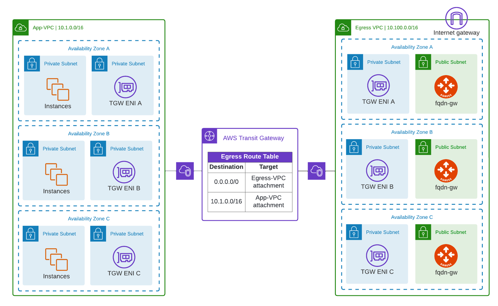

# Egress FQDN HA simulation



## Prerequisites

Please make sure you have:
- Aviatrix Controller 6.7
- AWS access account onboarded. 

## Environment Variables

To run this project, you will need to set the following environment variables

Variables | Description
--- | ---
AVIATRIX_CONTROLLER_IP | Aviatrix Controller IP or FQDN 
AVIATRIX_USERNAME | Aviatrix Controller Username
AVIATRIX_PASSWORD | Aviatrix Controller Password
TF_VAR_aws_account | AWS Aviatrix Account 

## Run Locally

Clone the project

```bash
git clone https://github.com/bayupw/egress-ha-simulation
```

Go to the project directory

```bash
cd egress-ha-simulation
```

Set environment variables

```bash
export AVIATRIX_CONTROLLER_IP="aviatrixcontroller.aviatrix.lab"
export AVIATRIX_USERNAME="admin"
export AVIATRIX_PASSWORD="aviatrix123"
export TF_VAR_aws_account="aws-account"
```

Terraform workflow

```bash
terraform init
terraform plan
terraform apply -auto-approve
```